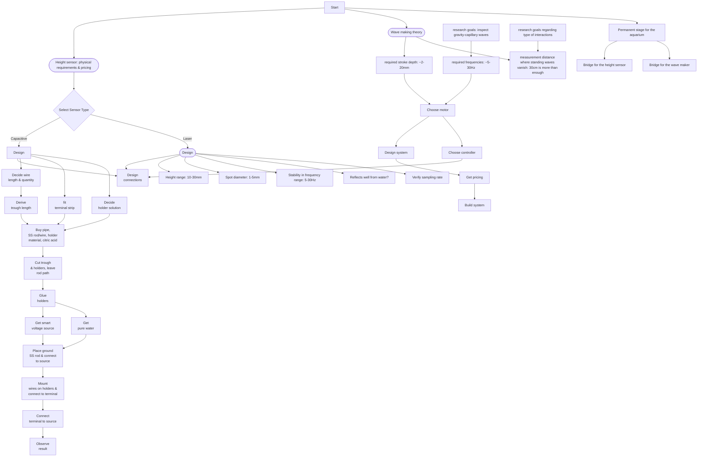

### Administrative
1. Get access to uni. systems with the lab under Sprinzak.
2. Safety and return a validation doc.
3. OTP?
4. Access to printer.
5. Duplicate backdoor key.

### General
1. Learn git and absorb into workflow.

### Science
1. Finish reading Zappa's paper about amplitudes/slopes of capillary waves.
2. Update Yaron are reestimate requirements from wave maker and height sensor.

### Aquarium
1. Measure the vibration amplitudes and decide required damping.
2. Understand how you lock the aquarium in place, and width of bridges.
3. Look in the internet for a good cheap stage:
   1. Right proportions to hold the aquarium, bridge and locks.
   2. Nice height.

### Wave maker
1. Refind the servo motor that we found.
2. Make a complete scheme of the plunger solution.
3. Once we settle on a complete solution, including exact parts, talk to Tomer/Yosi again about it.
4. Reach out to Itsik for construction

### Height sensor
1. Verify that the capacitive gauge satisfies our sensitivity requirements.
2. 
3. Capacitive gauge making:
    1. Decide length and number of wires.
    2. Derive length of trough.
    3. Design electric connections. Fit terminal strip.
    4. Decide on solution for holders.
    5. Buy: tantalum - Aviv, pipe for trough, stainless steel rod/wire, material for holders, citric acid - Liron, terminal - Liron, power source - Yosi.
    6. Cut trough and holders. Leave path for rod.
    7. Glue holders.
    8. Get smart voltage source.
    9.  Get pure water.
    10. Put ground SS rod and connect to source.
    11. Put wires on holders and connect to terminal.
    12. Connect terminal to source.
    13. Observe result.
 

### Camera
1. Study camera software.
2. Measure width of container.
3. Order/build mount (including weight) + pitch axis + how to measure the pitch.
4. Verify camera screws fine to mount.

### Possible schedule clashes
I think there should be none. The gauge should be non-intrusive, but the assemble is very simple.

22/12
- Elena for OTP and printer access?
- Keys.
- For Aviv: change garbage? Where do we get tantalum?
- Call Yishay/Hanoch.

## daily

### daily note
- what was done
- what is to be done tomorrow

### git
Edit → Add → Commit → Push

This is the project backup workflow. All tracked files, including moved or renamed files, are preserved both locally and on GitHub.

1. Daily / session work
Edit files as needed (code, documentation, data notes).
Add new files or moved files to Git tracking:

    git add <file_or_folder>

or to add everything modified/untracked:

    git add .gitignore README.md docs project_env.sh   // ignore until we have a stable version

2. Commit changes
Commit logically grouped changes with a clear message:

    git commit [--amend] -m "Daily: [changes I've made]"

Commit at the end of each logical task or end-of-day. This keeps your history clean.

3. Push to GitHub
Upload local commits to the online backup:

    git push [--force-with-lease // if --amend was done.]

After this, your local repository and the remote repository are in sync.
GitHub now acts as a full backup of all tracked files and history.

4. Optional: Pull before starting work on another machine
If you work on multiple machines:

git pull

Ensures you have the latest state before editing.

5. Best practices

- Commit small, logical changes rather than massive, vague commits.
- Track only what matters (use .gitignore to skip temporary files, generated data, and .obsidian).
- Do not push large raw data files if they exceed GitHub limits; keep them local or use Git LFS.
Tag stable milestones (optional):

git tag v1.0
git push --tags
