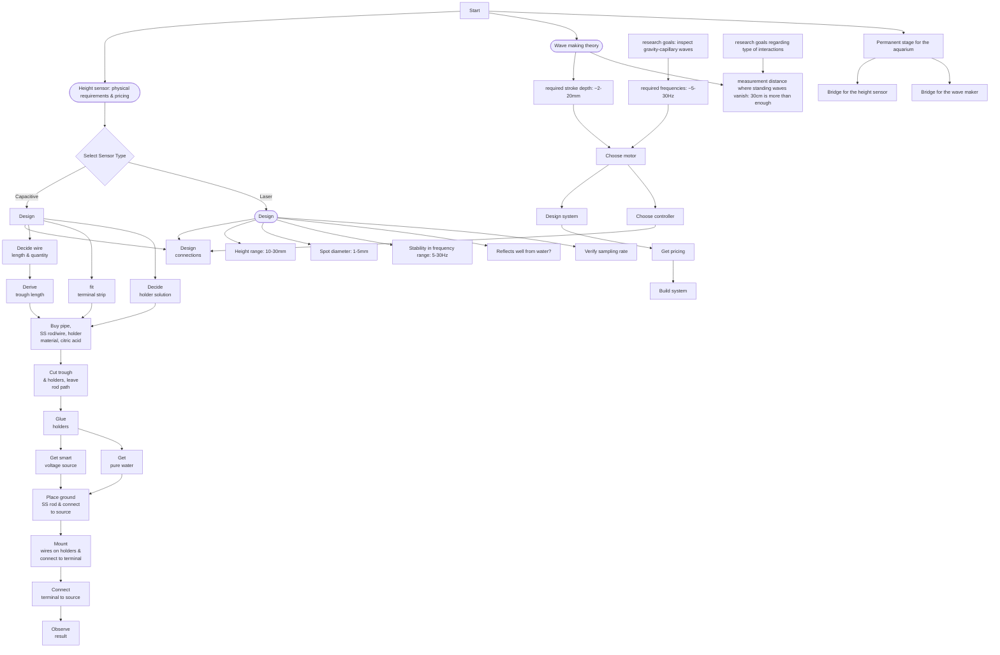

### Back to Business
Draw on some board the various tasks that need to be handled. That would be:
  a. The Boson
  b. The big container
  c. The seismic analysis
  d. The height sensor
  e. The aquarium's structure
  f. The wave maker
  g. The alternative height sensor

### Administrative
1. Access to printer.
2. On Sunday/Monday morning, talk to Helena about internet connection in the shed.

### General
1. Learn git and absorb into workflow.

### Science
1. Overview of spectrum of sea water capillary with various surfactants.
1. Finish reading Zappa's paper about amplitudes/slopes of capillary waves.

### Boson
1. Go through the state of the code, write down here what we can and cannot do.
2. A new pin for the box?
3. See that I know where the parts are.

### Aquarium
1. Clean the shed.
2. Go through the code, see where we're at.
3. What was the state of the vibration analysis?
4. Understand how to lock the aquarium in place, and width of bridges.

### Wave maker
1. Review the parts that we have.
2. Make a complete scheme of the plunger solution.
3. Once we settle on a complete solution, including exact parts, talk to Tomer/Yosi again about it.
4. Reach out to Itsik for construction

### Height sensor
1. Verify that the capacitive gauge satisfies our sensitivity requirements.
2. Review the logs from the height sensor manufacturing.
3. Capacitive gauge making.
 

### Camera
1. Study camera software.
2. Measure width of container.
3. Order/build mount (including weight) + pitch axis + how to measure the pitch.
4. Verify camera screws fine to mount.

### Possible schedule clashes
I think there should be none. The gauge should be non-intrusive, but the assemble is very simple.

## periodically

### daily note
- what was done
- what is to be done tomorrow

### git
Edit → Add → Commit → Push

This is the project backup workflow. All tracked files, including moved or renamed files, are preserved both locally and on GitHub.

1. Daily / session work
Edit files as needed (code, documentation, data notes).
Add new files or moved files to Git tracking:

    git add <file_or_folder>

or to add everything modified/untracked:

    git add .gitignore README.md docs project_env.sh   // ignore until we have a stable version

2. Commit changes
Commit logically grouped changes with a clear message:

    git commit [--amend] -m "Daily: [changes I've made]"

Commit at the end of each logical task or end-of-day. This keeps your history clean.

3. Push to GitHub
Upload local commits to the online backup:

    git push [--force-with-lease // if --amend was done.]

After this, your local repository and the remote repository are in sync.
GitHub now acts as a full backup of all tracked files and history.

4. Optional: Pull before starting work on another machine
If you work on multiple machines:

git pull

Ensures you have the latest state before editing.

5. Best practices

- Commit small, logical changes rather than massive, vague commits.
- Track only what matters (use .gitignore to skip temporary files, generated data, and .obsidian).
- Do not push large raw data files if they exceed GitHub limits; keep them local or use Git LFS.
Tag stable milestones (optional):

git tag v1.0
git push --tags
